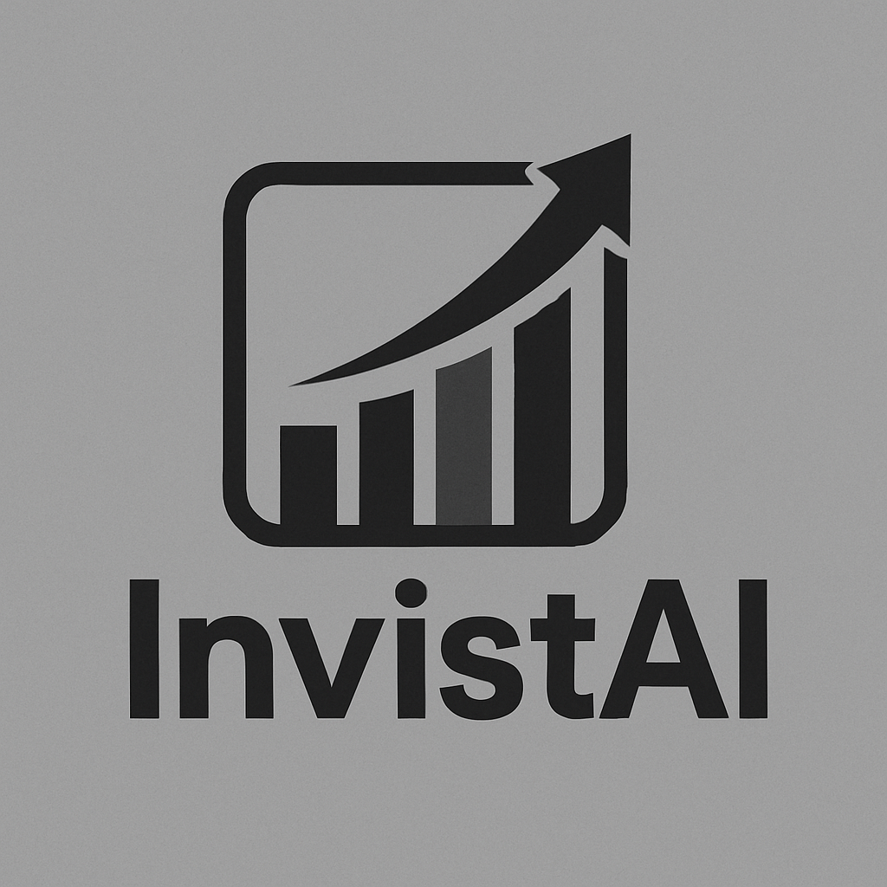

<p align="center">
  
</p>

<h1 align="center">Versão CLI</h1>

<p align="center">
  <a href="#-funcionalidades">Funcionalidades</a> •
  <a href="#-requisitos">Instalação</a> •
  <a href="#automatizando-o-acesso-de-qualquer-lugar-no-terminal">Automatize o Terminal</a> •
  <a href="#-menus">Menu</a> •
  <a href="#-onde-os-dados-são-salvos">Dados</a> •
  <a href="https://github.com/pedrorcruzz/invista-ai/blob/develop/LICENSE">Licença</a>
</p>

<p align="center">
  <b>Gerencie seus investimentos. Controle seus gastos. Tudo no seu terminal.</b>
</p>

> **📝 Nota:** Este ainda não é um CLI 100% empacotado, mas você pode executá-lo de qualquer lugar do terminal criando scripts shell conforme explicado na seção "Automatizando o Acesso de Qualquer Lugar no Terminal" abaixo.

---

## ✨ Funcionalidades

- <b>Controle de Investimentos</b> — Adicione/edite dados mensais, veja lucros brutos/líquidos e visualize seu progresso.

- <b>Controle detalhado de FIIs</b> — Gerencie cada fundo imobiliário individualmente, com múltiplos aportes por mês, registro de quantidade, preço, data e valor de cada aporte.

- <b>Registro de dividendos e vendas</b> — Lance dividendos recebidos por FII e registre vendas de cotas por aporte, com cálculo automático de lucro e taxas.

- <b>Cálculo automático de DARF</b> — O sistema calcula automaticamente o imposto devido sobre vendas de FIIs, notifica o valor e o prazo de pagamento, e exibe alertas quando houver DARF a pagar.

- <b>Resumos mensais e anuais detalhados</b> — Veja relatórios completos com percentuais de lucro por FII, separação clara entre Renda Fixa e FIIs, e visualização alinhada de todos os dados.

- <b>Visualização de FIIs do mês</b> — Veja todos os FIIs do mês, aportes com datas, quantidades e valores, e dividendos recebidos, tudo organizado e fácil de ler.

- <b>Separação total entre Renda Fixa e FIIs</b> — Menus, relatórios e operações totalmente separados para cada tipo de investimento.

- <b>Confirmação explícita para remoção</b> — Remoção de FIIs e produtos exige confirmação clara do usuário.

- <b>Gestor Inteligente de Gastos</b> — Planeje compras, gerencie parcelas e receba recomendações inteligentes.

- <b>Dados Locais</b> — Todos os seus dados são salvos localmente em arquivos JSON simples.

- <b>Interface Bonita no Terminal</b> — Menus modernos com bordas para uma experiência CLI agradável.

- <b>CLI Universal</b> — Use com <code>go run</code>, construa um binário, use Docker ou chame de scripts <code>fish</code>, <code>zsh</code>, <code>sh</code> em qualquer lugar.

---

## 📋 Requisitos

- É necessário ter o [Go](https://golang.org/dl/) instalado na sua máquina (versão recomendada: Go 1.20 ou superior).
- **Ou** ter o [Docker](https://docs.docker.com/get-docker/) instalado para usar a versão containerizada.

## 🚀 Primeiros Passos

### 1. Clone o Repositório

```sh
git clone https://github.com/pedrorcruz/invista-ai-cli
cd invista-ai-cli
```

### 2. Rodar com Go

```sh
go run main.go
```

### 3. Buildar & Usar em Qualquer Lugar

```sh
go build -o invista-ai
./invista-ai
```

### 4. Usar com Docker

#### Opção A: Build Local (Criar Imagem)

<details>
<summary>Clique aqui para ver como criar imagem Docker localmente</summary>

```sh
# Build da imagem localmente
docker build --no-cache -t invista-ai-cli .

# Executar o container (sem volume - dados ficam no container)
docker run -it invista-ai-cli

# Executar o container com volume para persistir dados
docker run -it -v invista-ai-data:/app/data invista-ai-cli
```

</details>

#### Opção B: Usar Imagem do Docker Hub (Recomendado)

<details>
<summary>Clique aqui para ver como usar imagem do Docker Hub</summary>

```sh
# Baixar a imagem oficial do Docker Hub
docker pull pedrorcruzz/invista-ai-cli:v1.3

# Montar e executar o container com nome (sem volume - dados ficam no container)
docker run -it --name invista-ai-cli pedrorcruzz/invista-ai-cli:v1.3

# Montar e executar o container com volume para persistir dados
docker run -it --name invista-ai-cli -v invista-ai-data:/app/data pedrorcruzz/invista-ai-cli:v1.3
```

</details>

**💡 Diferença:**

- **Opção A**: Você cria a imagem localmente com `docker build`
- **Opção B**: Você baixa uma imagem já pronta do Docker Hub com `docker pull`

#### 📦 Persistência de Dados com Volumes

**⚠️ Importante:** Por padrão, os dados são salvos dentro do container. Se você remover o container, perderá todos os dados. Para persistir os dados, use volumes:

**Sem Volume (Dados ficam no container):**

```sh
docker run -it --name invista-ai-cli pedrorcruzz/invista-ai-cli:v1.3
```

**Com Volume (Dados persistem mesmo removendo o container):**

```sh
# Criar volume (primeira vez)
docker volume create invista-ai-data

# Executar com volume
docker run -it --name invista-ai-cli -v invista-ai-data:/app/data pedrorcruzz/invista-ai-cli:v1.3
```

**💡 Vantagens do Volume:**

- Dados persistem mesmo se você remover o container
- Pode usar o mesmo volume em diferentes containers
- Backup mais fácil dos dados
- Recuperação de dados em caso de problemas

**📁 Dados Persistidos:**

- `dados.json` (raiz do projeto) - Dados de investimentos
- `data/produtos.json` - Dados do gestor de gastos

#### Comandos Úteis

**💡 Dicas:**

- O programa executa automaticamente quando você monta o container
- Para acessar o shell do container (debug): `docker run -it pedrorcruzz/invista-ai-cli:v1.3 sh`
- Para executar em container já rodando: `docker exec -it invista-ai-cli /app/invista-ai-cli`
- Para ver containers ativos: `docker ps`
- Para parar um container: `docker stop invista-ai-cli`
- Para remover um container: `docker rm invista-ai-cli`

**📦 Imagem disponível em:** [DOCKERHUB](https://hub.docker.com/repository/docker/pedrorcruzz/invista-ai-cli/general)

**🔒 Segurança:** Os dados são salvos localmente na imagem ou no volume Docker.

---

## Automatizando o Acesso de Qualquer Lugar no Terminal

Para rodar o InvistAI de qualquer diretório no seu terminal, você pode criar um script e uma função (ou alias).

### 1. Crie um Script Shell

Crie um arquivo chamado `invista-ai.sh` (ou qualquer nome que preferir) em um diretório de sua escolha (ex: `~/.dotfiles/scripts`). Adicione o conteúdo abaixo, **trocando o caminho do `cd` para o local correto do seu projeto**:

```bash
#!/bin/bash

cd ~/Developer/Scripts/invista-ai  # ⚠️ TROQUE PELO SEU CAMINHO REAL

./invista-ai  # ⚠️ TROQUE PELO NOME DO SEU BINÁRIO
sleep 1.3
clear
```

### 2. Torne o Script Executável

Dê permissão de execução ao script:

```sh
chmod +x invista-ai.sh
```

### 3. Crie uma Função (Fish) ou Alias (Zsh/Bash)

#### Fish Shell

Adicione a função abaixo ao seu arquivo ~/.config/fish/config.fish:

<details>
<summary>Clique aqui para ver a função Fish</summary>

```fish
function invista-ai
    set prev_dir (pwd)
    cd ~/.dotfiles/scripts # ⚠️ TROQUE PELO DIRETÓRIO DO SEU SCRIPT
    ./invista-ai.sh
    cd $prev_dir
end
```

</details>

#### Zsh/Bash

Adicione o alias abaixo ao seu ~/.zshrc ou ~/.bashrc:

<details>
<summary>Clique aqui para ver o alias Zsh/Bash</summary>

```bash
alias invista-ai="cd ~/.dotfiles/scripts && ./invista-ai.sh && cd -" # ⚠️ TROQUE PELO DIRETÓRIO DO SEU SCRIPT
```

</details>

### 4. Recarregue sua Configuração do Shell

Após adicionar a função ou alias, recarregue sua configuração:

#### Fish

<details>
<summary>Clique aqui para ver como recarregar configuração Fish</summary>

```bash
source ~/.config/fish/config.fish
```

</details>

#### Zsh

<details>
<summary>Clique aqui para ver como recarregar configuração Zsh</summary>

```bash
source ~/.zshrc
```

</details>

#### Bash

<details>
<summary>Clique aqui para ver como recarregar configuração Bash</summary>

```bash
source ~/.bashrc
```

</details>

Agora você pode rodar o InvistAI de qualquer diretório apenas digitando `invista-ai` no terminal.

---

## 🧩 Menus

### Menu Principal

```
1. Ver resumo completo
2. Renda Fixa
3. FIIs
4. Gestor Inteligente de Gastos
5. Retirar Lucro
6. Sair do programa
```

### Gestor Inteligente de Gastos

```
1. Adicionar produto
2. Remover produto
3. Listar meses
4. Atualizar lucro mensal
5. Editar produto
6. Antecipar parcelas
7. Configurar porcentagem segura
8. Voltar ao menu principal
```

- Você pode selecionar produtos pelo número ou digitando o nome!
- Todos os menus são exibidos em caixinhas para clareza e estilo.

---

## 📦 Onde os Dados São Salvos

- Dados de investimentos: <code>dados.json</code>
- Dados do gestor de gastos: <code>data/produtos.json</code>

---

## 📝 Licença & Créditos

- LICENÇA [MIT](https://github.com/pedrorcruzz/invista-ai/blob/develop/LICENSE)
- Criado por [Pedro Rosa](https://www.linkedin.com/in/pedrorcruzz/)

---

<p align="center">
  <b>Gerencie sua vida financeira direto do terminal!</b>
</p>
